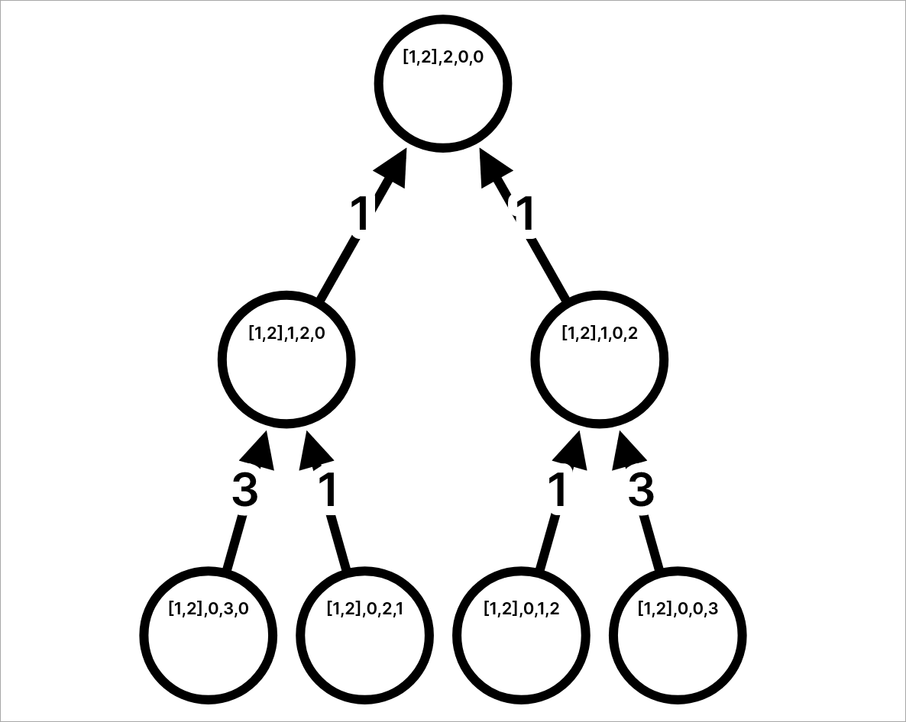

# APPLE DIVISION

| var                  | desc                 |
| -------------------- | -------------------- |
| $n$                  | Number of apples     |
| $p_1, p_2, ..., p_n$ | Weight of each apple |

In this challenge we have $n$ apples with weights $p$. We have find out how we split the weights of the apples into two sets so we have the least possible difference between the two sets.

As constraint we know that $n \le 20$. So we can technically brute force each possible combination and return the smallest difference of all the combinations. Recursion would be a good way to solve this, as the steps are repeated throughout the various elements of the initial input.

## Brute Force

We start with a `Vec<i64>` of $n$ elements. We have a recursive function which takes as arguments the `Vec<i64>`, the length of the vector $n$, and two variables `sum1` and `sum2`.

When we call the function, we are going through these steps:

1. Check if $n = 0$.
2. Call function recursively, decrementing $n$ by one and adding to `sum1` the value at index $n - 1$ and assign the result to `diff1`.
3. Call function recursively, decrementing $n$ by one and adding to `sum2` the value at index $n - 1$ and assign the result to `diff2`.
4. When a recursive function reaches to a point where $n = 0$ then it returns the absolute value of the difference between `sum1` and `sum2`
5. When both recursive functions reach the end of the function, then it returns the smaller value of the two values in `diff1` and `diff2`.
6. This process repeats until the call stack reaches to the initial function call.
7. Then the return value will be the smallest difference after trying every single combination possible.

If we had a vector `[ 1, 2 ]` with $n = 2$ the tree would look like this:



## Code

In Rust 🦀 code:

```rust
fn main() {
    let inp: Vec<i64> = std::io::read_to_string(std::io::stdin())
        .unwrap()
        .lines()
        .skip(1)
        .flat_map(|s| s.split_whitespace())
        .map(|n| n.parse().unwrap())
        .collect();

    println!("{}", min_diff(&inp, inp.len(), 0, 0));
}

fn min_diff(v: &Vec<i64>, n: usize, sum1: i64, sum2: i64) -> i64 {
    if n == 0 { return (sum1 - sum2).abs(); }

    let diff1 = min_diff(v, n - 1, sum1 + v[n - 1], sum2);
    let diff2 = min_diff(v, n - 1, sum1, sum2 + v[n - 1]);

    diff1.min(diff2)
}
```
