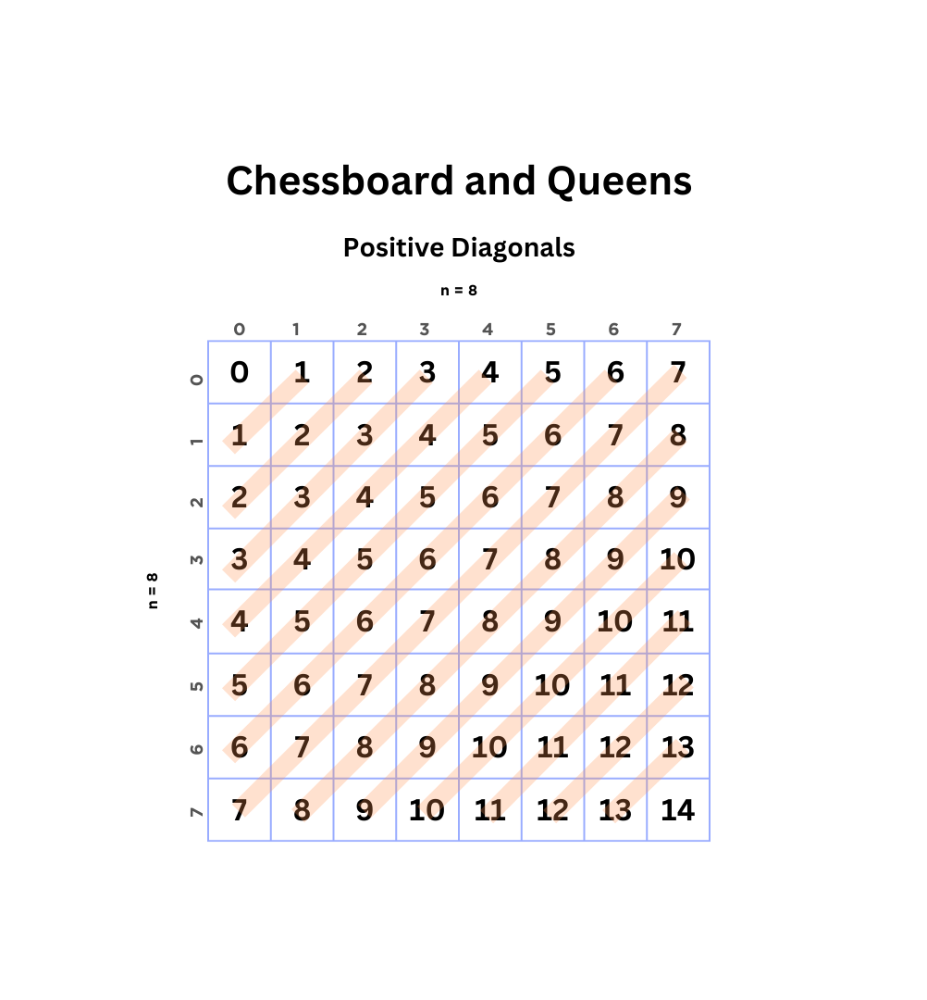
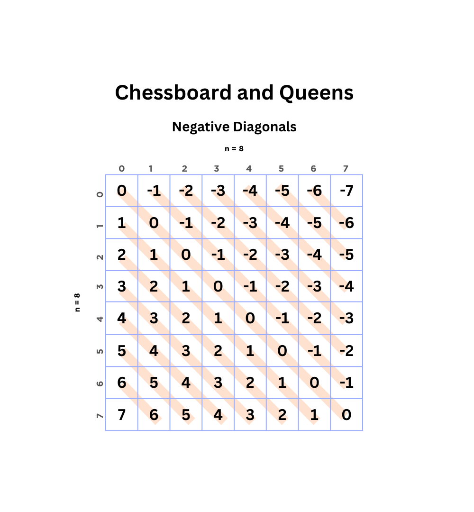

# CHESSBOARD AND QUEENS

**Input:** Eight lines with eight characters each, free (`.`) or reserved (`*`)

This is the well known [Eight Queens Problem](https://en.wikipedia.org/wiki/Eight_queens_puzzle). The goal is to place eight queens on a chessboard in a way they don't attack each other. Additionally some fields are already reserved which means we cannot place any queens there.

## Approach

We know that in each row can only be one queen. Otherwise they would attack each other. So we store the input lines as `Vec`s and iterate from one row to the next and decide where to place a queen. This decision happens on the basis of the already placed queens and their attack range.

## Attack Ranges

We have to keep track of columns, positive diagonals and negative diagonals. If for example in the first row a queen is placed at column $2$, we cannot place another queen in column two ever. So in the `col` variable we store a $2$ so for the next recursive function call we know that there can't be another queen placed at index $2$.

As we observe, to keep track of the reserved columns is pretty straight forward. But how do we keep track of diagonals?

### Diagonals

Because a queen's attack range can be a positive or negative diagonal, we also cannot place any other queen in the range of either one of these diagonals.

#### Positive

As for positive diagonal `pos_diag`, we can see a pattern in a $n \times n$ chessboard: When we add the row and column index $r + c$ we get a positive diagonal.



So if we place a queen at e.g. row 1 column 5 ($1 + 5 = 6$) we cannot place another queen in any other field where $r + c = 6$.

#### Negative

The same logic applies for negative diagonals `neg_diag`, except that we subtract the column index from the row index $r - c$.



Let's say the queen we placed before at row 1 column 5 ($1 - 5 = -4$), we also cannot place another queen at any field where $r - c = -4$.

## Reserved Fields

The last thing we have to remember is that in the input we have some fields denoted with `*` which are reserved. Meaning we can't place queens in these fields. But these fields do not prevent queens from attacking each other.

## Translating to Code

We take the input string and put it into a 2-D vector `Vec<Vec<char>>`, where the outer vector holds vectors representing the rows and the inner vector holds characters denoting the columns.

Then we create three `HashSet`s for `col`, `pos_diag` and `neg_diag`. In this way we keep track of the attack ranges so we know where to not place queens. We choose `HashSet` in order to ensure that the integers are unique.

Then we create a recursive function and pass it the 2-D vector representing the chessboard, the index of the first row ($0$), and the created `HashSet`s.

The base case of this recursive function is `r == 8`. So when we reach row 8 we know that we are at the end of the chessboard and we have another combination of queens.

On each recursive function call we iterate over a range from $0, 1, ..., 7$ (8 times) representing the columns in that specific row. So for each field in the row we check if there is a reserved field `*`.

Then we check:

1. Does `col` contain the current column index?
2. Does `pos_diag` contain the result of $r + c$ where $c$ is the current field?
3. Does `neg_diag` contain the result of $r - c$ where $c$ is the current field?

If any of these conditions evaluate to `true` then we just `continue` with the next field.

If not then we place a queen. Meaning we insert the appropriate integer into the `HashSet`s:

1. `col` $\rightarrow c$ where $c$ is the current field's column index
2. `pos_diag` $\rightarrow r + c$
3. `neg_diag` $\rightarrow r - c$

Then we recursively call the function where we increment $r$ by $1$. So basically going to the next row. When the function returns we store the return value ($1$) into `result`. `result` is the variable which will hold the number of different combinations of placing queens.

After the recursive function call we backtrack. Basically undoing what we inserted into the `HashSet`s before. This is to ensure that we get all possible combinations.

## Code

In Rust 🦀 code:

```rust
use std::collections::HashSet as HS;

fn main() {
    let board: Vec<Vec<char>> = std::io::read_to_string(std::io::stdin())
        .unwrap()
        .lines()
        .map(|s| s.chars().collect())
        .collect();

    let (mut col, mut pos_diag, mut neg_diag) = (HS::new(), HS::new(), HS::new());

    println!(
        "{}",
        queens(&board, 0, &mut col, &mut pos_diag, &mut neg_diag)
    );
}

fn queens(
    board: &Vec<Vec<char>>,
    r: i8,
    col: &mut HS<i8>,
    pos_diag: &mut HS<i8>,
    neg_diag: &mut HS<i8>,
) -> i8 {
    let mut res = 0;

    if r == 8 { return 1; }

    for c in 0..8 {
        if board[r as usize][c as usize] == '*'
            || col.contains(&c)
            || pos_diag.contains(&(r + c))
            || neg_diag.contains(&(r - c))
        {
            continue;
        }

        col.insert(c); pos_diag.insert(r + c); neg_diag.insert(r - c);
        res += queens(board, r + 1, col, pos_diag, neg_diag);
        col.remove(&c); pos_diag.remove(&(r + c)); neg_diag.remove(&(r - c));
    }
    res
}
```
