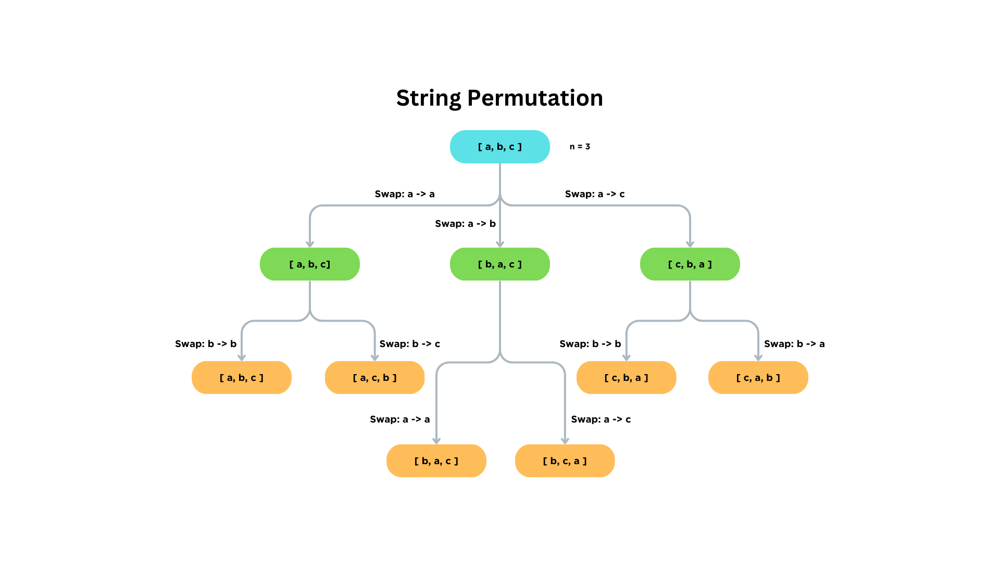

# CREATING STRINGS

| var | desc                   |
| --- | ---------------------- |
| $n$ | Length of input string |
| $k$ | Number of permutations |

The task is to generate all possible permutations of a given string with length $n$.

## Logic

To get all permutations of a given string, we need to understand the logic behind swapping characters.

1. Swap the first letter with any letter in the string (including the first letter itself).
2. Swap the second letter with any letter in the string (including the second letter itself) EXCEPT the first one.
3. Swap the third letter with any letter in the string (including the third letter itself) EXCEPT the first and second one.
4. and so on...

This would look like this:



We can conclude, that the steps are repeated $n$ times where $n$ is the length of the input string. So recursion might be appropriate to solve the problem.

## Recursion

A way to think about it is that we start at the left most letter `left`. When we swapped every letter with `left`, including `left` itself. We can achieve this by iterating over each index starting from `left` where in each iteration `right` holds the next character in the string.

So the base case of the recursion should be when `left` is equal to $n$, the length of the input string. Because when `left` is equal to $n$ we have found another permutation of the input string.

We also have to consider that we need a backtrack. This backtrack ensures that we recover the swapped letter to its positions before swapping. So on each recursive function call we swap the letters, call the function recursively again, and after the caller returns to the callee we return the letters to the positions before the recursive function call.

## Ordered Set

The last thing to consider is that there might be repetitions. So if we swap for example the first two letters of `aab` we would get the same exact string `aab`.

In order to avoid this when reaching the base case, we store the permutation in a `BTreeSet`. A `BTreeSet` is ordered and ensures that every entry is unique. So there won't be unnecessary repetitions.

Also, in the assessment we are prompted to output the number of possible permutations. So we can just output the length of the `BTreeSet`.

## Code

In Rust 🦀 code:

```rust
use std::collections::BTreeSet;

fn perm(left: usize, chars: &mut Vec<char>, res: &mut BTreeSet<String>) {
    if left == chars.len() {
        res.insert(chars.iter().collect());
        return;
    }

    (left..chars.len()).for_each(|right| {
        chars.swap(left, right);
        perm(left + 1, chars, res);
        chars.swap(left, right);
    });
}

fn main() {
    let mut inp: Vec<char> = std::io::read_to_string(std::io::stdin())
        .unwrap()
        .trim()
        .chars()
        .collect();

    let mut res = BTreeSet::new();

    perm(0, &mut inp, &mut res);

    println!("{}", res.len());
    res.iter().for_each(|s| println!("{s}"));
}
```
